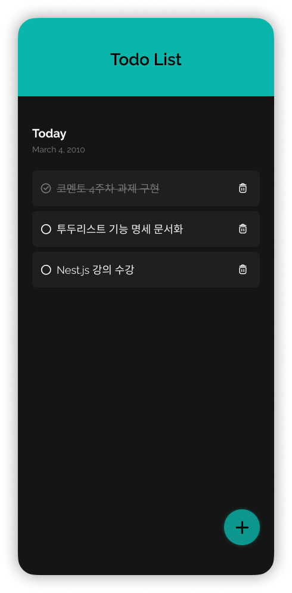

# iOS Calculator Clone

직무 부트캠프 '코멘토' 과제물의 일환으로 투두리스트 애플리케이션을 구현한 프로젝트입니다. <br/>
단순한 UI 구현을 넘어, MVC 패턴을 적용하여 관심사 분리하는데 주력했습니다.

## Preview



<br/>

## Tech Stack

- Core: HTML5, CSS3, Javascript
- Architecture: MVC Pattern (Model-View-Controller)
- Styling: SCSS (Dart Sass)
- Package Manager: NPM (Sass 컴파일 환경 구축)

<br/>

## Folder Structre

```
styles/
├── 📂 base/
│   ├── _font.scss            # 폰트 및 타이포 적용
│   ├── _reset.scss           # 브라우저 기본 스타일 초기화
├── 📂 mixins/
│   └── _mixins.scss          # 유틸리티 함수 (Flexbox)
todo-list/
├── 📂 assets/                # 이미지 및 정적 리소스
├── 📂 controller/
│   └── Controller.js           # 이벤트 핸들링 컨트롤러
├── 📂 model/
│   └── Todo.js                 # 핵심 계산 로직 및 상태 관리
├── 📂 styles/
│   ├── _main.scss             # SCSS entry point
│   ├── _variables.scss        # 색상 팔레트, 테마, 폰트 변수 정의
│   ├── style.css              # 컴파일된 CSS
│   └── style.scss             # 주요 스타일링
├── 📂 utils/
│   └── dateUtils.js           # 핵심 계산 로직 및 상태 관리
├── app.js                     # 애플리케이션 진입점
├── index.html                 # 메인 마크업
```

<br/>

## Key Features & Technical Decisions

**1. MVC 아키텍처 & 객체지향 설계**

Class 기반으로 Model, View, Controller의 역할을 철저히 분리하여 유지보수성을 확보했습니다.
<br/>특히 참조 공유를 통해 데이터 변경이 즉시 UI에 반영되도록 설계했습니다.

**2. 이벤트 위임 및 최적화**

개별 리스너 대신 상위 요소(`<uls>`)에 이벤트 위임을 적용해 메모리를 최적화하고, `submit` 이벤트를 활용해 버튼 클릭과 엔터 입력을 하나의 로직으로 효율적으로 처리했습니다.

**3. SCSS & 인터랙션 스타일 모듈화**

모노레포 구조의 `@use`, `msixin`로 코드 재사용성을 높이고, CSS transition과 클래스 토글링을 통해 부드러운 입력 폼 확장 애니메이션을 구현했습니다.

<br/>

## Getting Started

**1. Installation**

프로젝트를 클론하고 필요한 의존성(Sass)을 설치합니다.

```bash
git clone https://github.com/vlmbuyd/comento.git
npm install
```

**2. Run(Compile SCSS)**

실시간으로 SCSS 변경 사항을 감지하여 CSS로 컴파일합니다.

```bash
npm run sass
```

**3. Open Project**

`index.html` 파일을 Live Server 등을 활용하여 브라우저에서 실행합니다.

<br/>
<br/>

## 기능 명세

### UI 및 아키텍처 구조

- [x] HTML/SCSS 기반의 모던한 UI 구현
- [x] MVC 패턴 기반의 디렉토리 및 클래스 구조 설계
- [x] DOM 이벤트 위임 및 컨트롤러 연결
- [x] 유틸리티 함수 분리

### 투두 관리 (CRUD)

- Create (추가)

  - [x] 우측 하단 플로팅 버튼 클릭 시 입력 폼 확장 애니메이션
  - [x] 텍스트 입력 후 엔터(Enter) 또는 버튼 클릭 시 리스트 추가
  - [x] 빈 값 입력 방지 (Validation)

- Read (조회)

  - [x] 전체 투두 리스트 렌더링
  - [x] 데이터가 없을 경우 '작성된 할 일이 없어요' 가이드 문구 및 이미지 노출

- Update (상태 변경)

  - [x] 체크 버튼 클릭 시 완료(Done) 상태 토글
  - [x] 완료된 항목에 대한 취소선 처리

- Delete (삭제)

  [x] 삭제 버튼 클릭 시 해당 항목 제거 및 리스트 갱신

- 부가 기능 및 UX
  - [x] 오늘 날짜 표시 (연, 월, 일 포맷팅)
  - [x] 입력 폼 활성화 시 자동 포커싱
